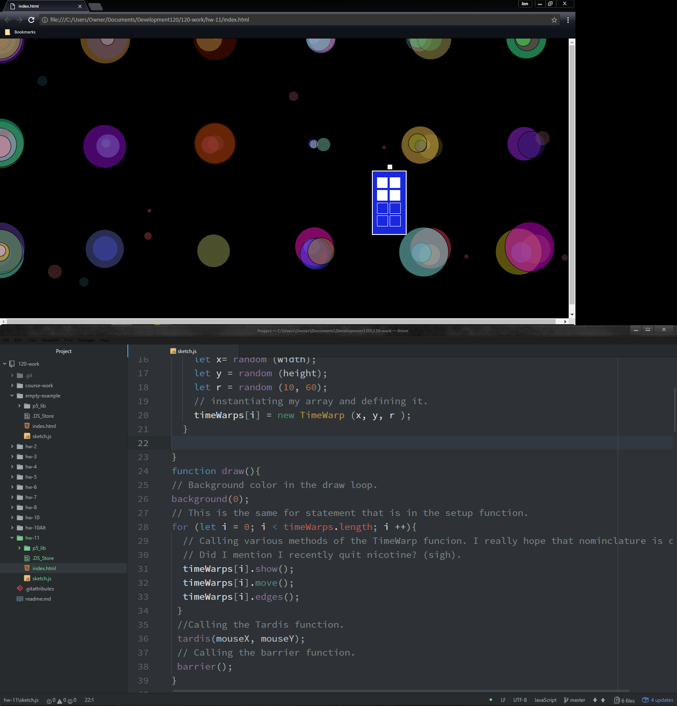

Jon Swallow 51

[Live "Object Oriented Programming" Sketch](https://jonswallow.github.io/120-work/hw-11/)


## Homework 11
### Technical Report
## Overview
Another week has past, and we  have learned...
  1. Object Oriented Programming
  2. Using Empty arrays and for statements to fill them within OOP.
  3. I actually used more than one method of programming in this one.
    1. I believe I still met the criteria.
    2. Always looking for a loophole when one is just not that good at programming for example, me.
## Breakthrough
I was able to trasnlate my idea into a working program, however not as efficiently as I would have liked to.
## Problems
---
I had several problems this week.
```
      1. I would have liked to done it all in Object Oriented methods.
          1. I wrote out two classes and could not get them to play  well together.
      2. I also had a hard time on my homemade cursor.
          1. I would have liked to use variables and statments but I
             could not get the math right.
```
----
##### Here is some code to look at.
----
```
function draw(){
// Background color in the draw loop.
background(0);
// This is the same for statement that is in the setup function.
for (let i = 0; i < timeWarps.length; i ++){
  // Calling various methods of the TimeWarp funcion. I really hope that nominclature is correct.
  // Did I mention I recently quit nicotine? (sigh).
  timeWarps[i].show();
  timeWarps[i].move();
  timeWarps[i].edges();
 }
 //Calling the Tardis function.
 tardis(mouseX, mouseY);
 // Calling the barrier function.
 barrier();
}
// Creating the TimeWrap Class with cunstructor.
class TimeWarp {
  constructor(x, y, r){
    this.x= x;
    this.y= y;
    this.r= r;
    // Did it like you did because it works better.
    this.deltX = random( -5, 5);
    this.deltY = random( -5, 5);
    // Wanted to randomize the color.
    this.red = random(0,255);
    this.green = random(0, 255);
    this.blue= random(0, 255);
  }
```
----

## Future work
Still here, working along as best I can. Hopefully the future will see a marked improvement.
## Conclusions
It is always the same the assignment comes in I stare at it.
1. I get out a pen and paper and attempt to come up with a plan.
2. I try to write some code.
3. It does not work.
4. I feel like having a nervous breakdown.
5. I continue despite my anxiety.
6. I end up altering code from the lesson in some way that is unique.
7. I feel I comprehend most of it until I go to implement it.
8. I end up getting lucky.
#### Helping Others
Still no opportunity to help others at this point in the week.
If I had any sense I would ask for help but I probably will not.
