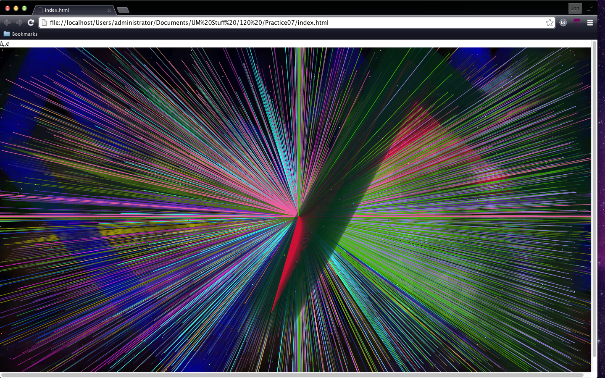
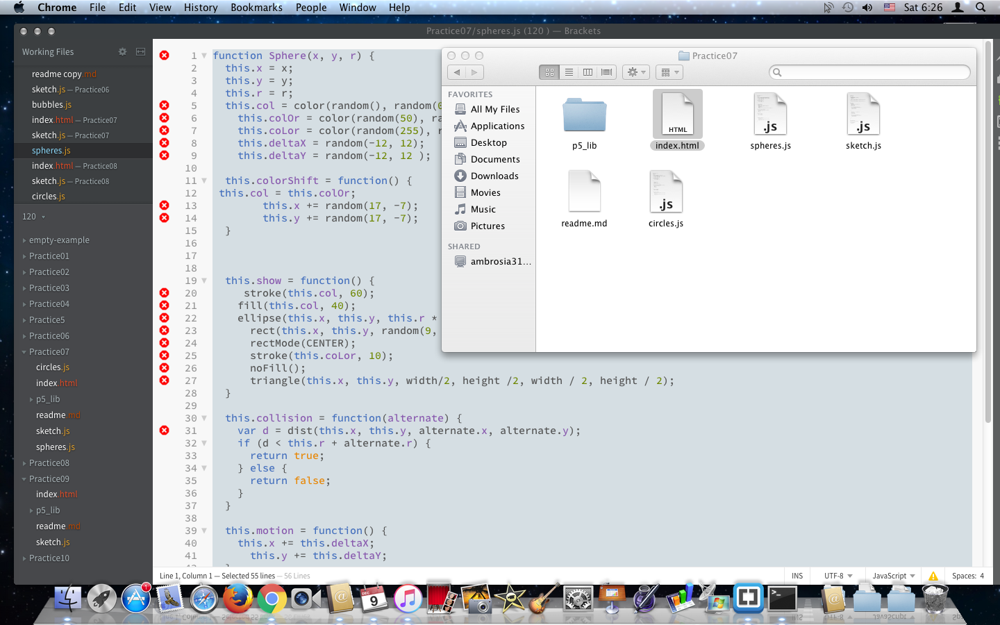
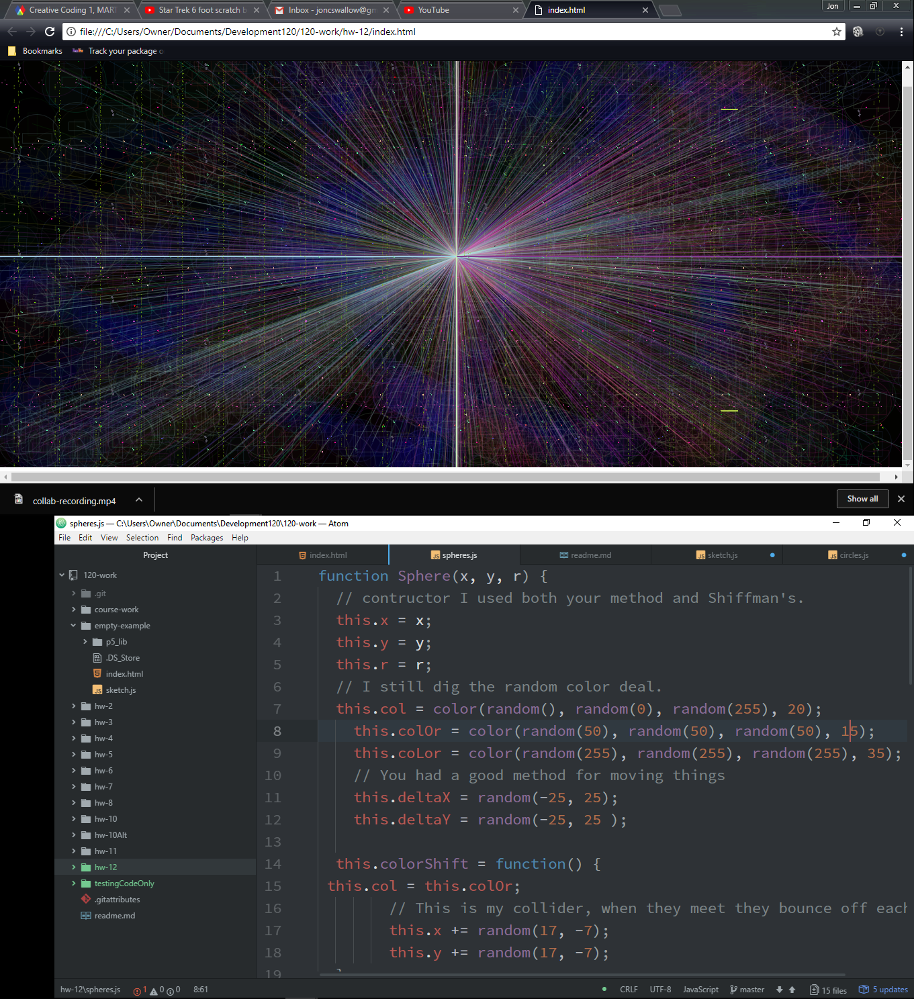

Jon Swallow 51

[Live "Interacting Objects" Sketch](https://jonswallow.github.io/120-work/hw-12/)


## Homework 12
### Technical Report
## Overview
Here we are at the end, and even though coding is akin to pulling my own teeth.
  - I wish it was not over
  - I need to learn more
  - Practice, practice, practice.
## Breakthrough
This week it just kind of evolved.
  - I started with an idea.
  - I was testing it and
  - I came up with something completely different.
    - I thought the linking of the documents would not work very well.
    - It worked very nicely.
## Problems
One heck of a lot of trial and error this time.
##### Here is some code to look at.
```
//Creating two seperate arrays.
var spheres= [];
var circles=[];
// Setup function, with background and frameRate for aesthetics.
function setup() {
  createCanvas(windowWidth, windowHeight);
    background('black');
    frameRate(25);
  //populating the arrays
  for (var i = 0; i < 22 ; i++) {
    spheres[i] = new Sphere(random(width), random(height), random(13, 23));
  }
 for (var i = 0; i < 30; i++) {
    circles[i] = new Circle(random(width), random(height), random(.2, 2));
 }
}
// Declaring the draw function.
function draw() {
  //Running the test on the array to weed out the usual suspect.
  for (var i = 0; i < spheres.length; i++) {
    spheres[i].show();
    spheres[i].motion();
    spheres[i].reversal();
```
---
## Pictures during and After.




## Future work
Well I see Dr. Musick I have you for two courses in the Spring.
  1. Pretty safe bet I am not done with coding.

## Conclusions
---
I enjoyed this class, it was very stressful at times.
#### Helping Others
I hope to this week.
  1. I also hope I have the right answer for them, when they ask.
