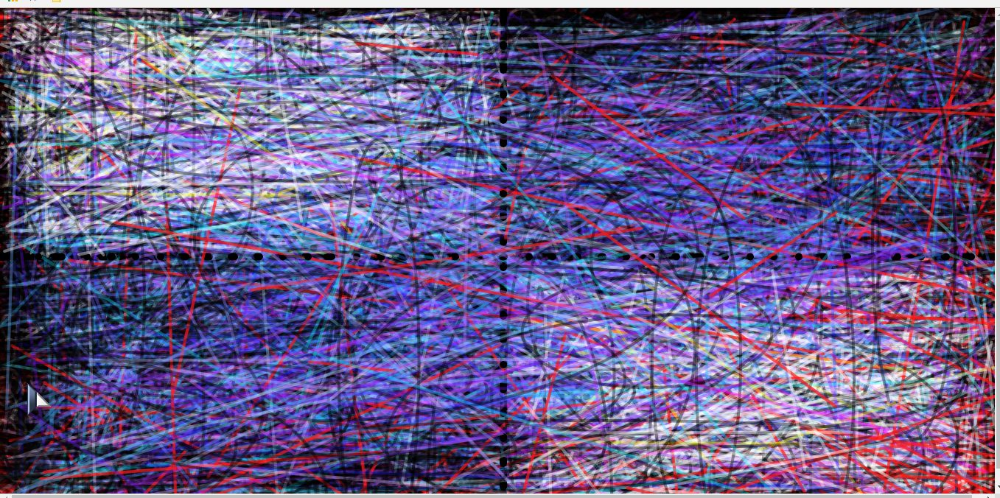
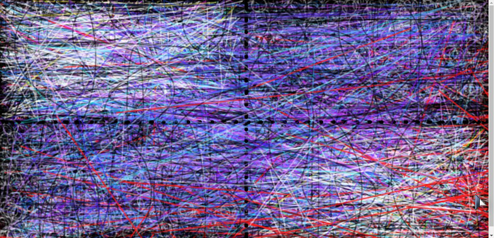
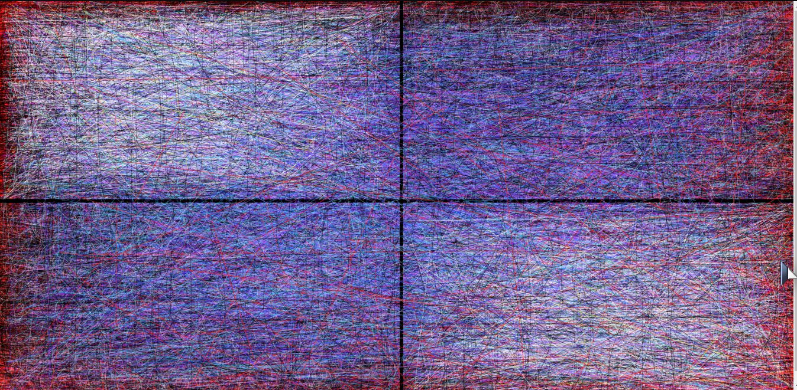

Jon Swallow 51

[Live "Algorithm" Sketch](https://jonswallow.github.io/github_repository/hw-6/)


## Homework 6

### Technical Report

----
#### Functionality in code


Please note: Let this picture develop. It evolves fairly quickly, but the desired effect takes a minute.

Left clicking the mouse gives you a fresh start.

Moving the mouse to the left of the screen darkens two quadrants.

Moving the mouse to the right of the screen lightens two quadrants. The effect is purposefully subtle.

---
## Overview

This was a tough week for me. We learned about..
  - Math functions
    - Operators
      - Addition, Subtraction
      - Absolute values
      - Rounding
      - Flooring
      - Ceiling
      - Squaring
      - Square Root
      - many more
 - Assigning Global variables
     - That are changeable.
      - Whose aspects can have random values assigned to them.
- Random function
- Mapping function
      - I spent about four hours trying to assign a color with a map function.
        - Always look in the book it describes this function pretty much working with mouseX.

----
## Breakthrough

The minute I said all the requirements are here put it down and turn it in.<br>
It can be so easy to sit there and worry and fuss I spent an outrageous amount of time spinning my wheels.<br>
When I said to myself, look it is the algorythm creating the piece. You met all the requirements.<br>
And to me it accoplishes what I wanted, which was the emulation of a Jackson Pollock piece.<br>

## Problems

Problems plagued me at every turn this week. First of all let me assure you that it is bloody hard to comprehend all that math.<br>
Given the format in which it lives. Equals is assignment of a value. It gets damn confusing, quickly.<br>
Carrying on I was left to manipulating code. I took it one step at a time and expirimented until I felt I had met the requirement,..<br>
that the required code worked, and was intregral to what I was trying to do with the piece. Not an easy task by any stretch.<br>
And there will be those critical of this piece, let me reassure you I did not take the easy way out in any fashion.<br>
There were also some nice little variances in look from system to system which prompted the need for me to change the sizing of elements.<br>
Lets see what I mean in pictures.

## Atom is as reliable as a New York realestate agent.
In other words it is not, so lets come up with inventive ways of making it work.







----
In the end I chose to go with the smaller version <br>
I had to significantly speed up the frame rate to make it fly.

____

```
function setup() {
  createCanvas(windowWidth, windowHeight);
  //My favorite Jacskson Pollack is red red red so I needed some red for a background
  background("rgb(255, 24, 24)");
  frameRate(200);

}

function draw() {

  //Assigning random values to variables.
  col.r = random(0, 255);
  col.g = random(0, 255);
  col.g = random(0, 255);

  //Random color assignments from 0 to 255 in each aspect red green and blue.
  col_n.r = random(0, 255);
  col_n.g = random(0, 255);
  col_n.b = random(0, 255);

  //Assigning random values to x and y of various variables.
  myObj.x = random (0, width);
  myObj.y = random (0, height);
  myObj_n.x = random (0, width);
  myObj_n.y = random (0, height);
  myObj_m.x = random (0, width);
  myObj_m.y = random (0, height);


  //Creating a series of sandboxes for safety
  push();
  ```

----
## Future work

I spent one hell of a lot of time this week making mistakes.<br>
I find this to be one of the best assurances that I have done something.<br>
I also know this will contribute to my future work because mistakes are the best teachers. <br>

## Conclusions

I think the biggest lesson I learned this week was do it by the numbers.<br>
Try and achieve your goals, meet the requirements and just be patient.<br>
Trial and error may be the only friend you have.<br>
Don't kick yourself for not bieng some genius coder at this time. <br>
Do <st>NOT</st> give up ever. Do it, hand it in, learn from it, and move on.

#### Helping Others
I do not think I answered any Issues this week so far.<br>
I do not think there have been too many posted, as of now. <br>
I also think I have been overzealous in answering, others need a chance as well. <br>
