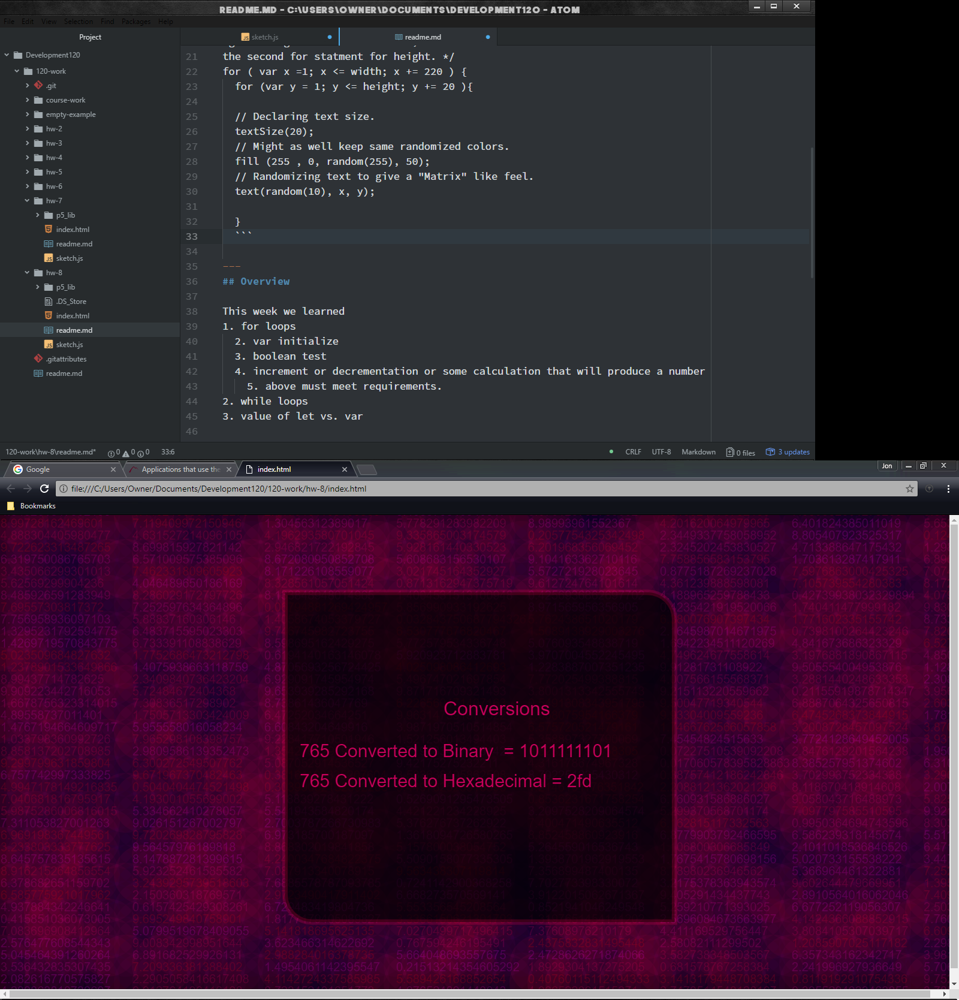

Jon Swallow 51

[Live "ForLoop" Sketch](https://jonswallow.github.io/120-work/hw-8/)


## Homework 8

### Technical Report

----
#### Functionality in code
Code learned this week used in this assignment.
- for loop
- nested for loop
- let vs. var
-----
```
/* Second set of nested for statements.
Again using the first for width, and ..
the second for statment for height. */
for ( var x =1; x <= width; x += 220 ) {
  for (var y = 1; y <= height; y += 20 ){

  // Declaring text size.
  textSize(20);
  // Might as well keep same randomized colors.
  fill (255 , 0, random(255), 50);
  // Randomizing text to give a "Matrix" like feel.
  text(random(10), x, y);

  }
  ```

---

---
## Overview

This week we learned
1. for loops
  - var initialize
  - boolean test
  - increment or decrementation or some calculation that will produce a number
    - above must meet requirements.
2. while loops
3. value of let vs. var


----
## Breakthrough
None this week and I found it difficult; the more complicated it gets the more difficult it
becomes.


## Problems
I had to experiment with push and pop for a several iterations to get the
code to function. I had a problem concerning frameRate that I could not solve.
It would be better for the background image to be at a higher smoother frame rate. When I tried this it made the conversions too difficult to keep up with. I sacrificed for functionality in this case.


----
## Future work
I hope to not remain discouraged but I feel like I am as lost as a bloody goose with this and
every week it gets worse. I fear I will pound my way through and develop such a hatred for the process that it remains out of my reach to become an effective coder.

## Conclusions
Going to keep on and eventually it will sink in. I have been lucky so far and am under no delusion that most of my work has been nothing but luck. I get the basics sure, I can manipulate some numbers just like anyone can, however to be effective and sit down and make a go of an idea in my mind and transfer it via code is out of my reach. I do find coding an
effective problem solving practice. To find the easiest cleanest way though forget about it.


#### Helping Others
I do not think I answered any Issues this week so far.<br>
I do not think there have been too many posted, as of now. <br>
I also think I have been overzealous in answering, others need a chance as well. <br>
