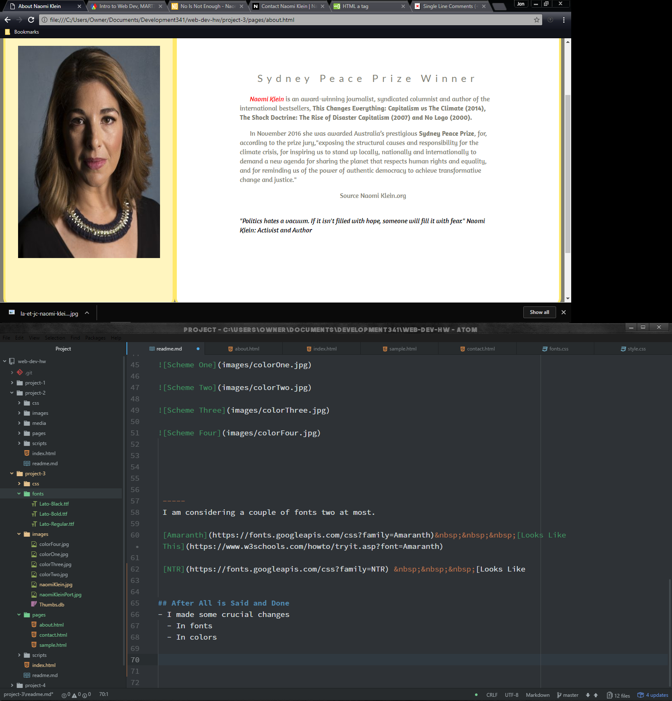

SWALLOW_HW-4_Hw-5_Mart341WebDev

[Live Page](https://jonswallow.github.io/github_repository/project-3)

## Project 3

### Literary Choice

No is Not Enough
  1. Naomi Klein
    2. Non-Fictional dissertation
      3. How we arrived at Trump and how to change things for the better.

## Introduction

I became interested in this book when; in an interview the author Naomi Klein <br>
describes Donald Trump as being a symptom of the existing system at the time. <br>
This piqued my interest as I, myself have held that his electoral win was the equal,<br>
and opposite reaction to a system in chaos. It is obvious that many can easily strongly<br>
dislike a figure such as Trump with seemingly little, or no reedeeming qualities whatsoever. <br>
I find Klein's views much more useful as they seek not to blame or create a scapegoat, but rather<br>
to admit where we went wrong as a country and what it will take to implement a positive solution. <br>
She seems to address the wholesale corporate fleecing of the nation, which is something that both <br>
political parties can take equal credit for. (This is the start of my Introduction I will continue later.)

## Sample

According to NBC News in December 2016, Trump’s picks for cabinet appointments had<br> a staggering combined net worth of $14.5 billion (not including “special adviser”<br> Carl Icahn, who’s worth more than $15 billion on his own). Moreover, the key<br> figures who populate Trump’s cabinet are more than just a representative sample of<br> the ultrarich. To an alarming extent, he has collected a team of individuals who<br> made their personal fortunes by knowingly causing harm to some of the most<br> vulnerable people on the planet, and to the planet itself, often in the midst of<br> crisis. It almost appears to be some sort of job requirement.<br>
<br>
Klein, Naomi. No Is Not Enough: Resisting Trump's Shock Politics and Winning the<br> World We Need (pp. 18-19). Haymarket Books. Kindle Edition.


-------

### About the Author
What follows is an excerpt from the book.<br>
##### I intend to research and write my own for the assignment.<br>
----
NAOMI KLEIN is an award-winning journalist, syndicated <br> columnist, documentary filmmaker and author of the <br> international bestsellers No Logo: Taking Aim at the Brand <br> Bullies, The Shock Doctrine: The Rise of Disaster Capitalism <br> and This Changes Everything: Capitalism vs. the Climate. She is <br> a senior correspondent for The Intercept and her writing <br> appears widely in such publications as The New York Times, Le <br> Monde, The Guardian and The Nation, where she is a contributing <br> editor. Klein is a member of the board of directors for <br> climate-action group 350.org and one of the organizers behind <br> Canada’s Leap Manifesto. In November 2016 she was awarded <br> Australia’s prestigious Sydney Peace Prize for, according to <br> the prize jury, “inspiring us to stand up locally, nationally <br> and internationally to demand a new agenda for sharing the <br> planet that respects human rights and equality.” Her books have <br> been translated into more than thirty languages. <br>

Klein, Naomi. No Is Not Enough: Resisting Trump's Shock <br> Politics and Winning the World We Need (p. 274). Haymarket Books. Kindle Edition.

### Color Schemes

I have a few things in mind but the one I like best compliments the color of the cover of the book.


 -----
 I am considering a couple of fonts two at most.

 [Amaranth](https://fonts.googleapis.com/css?family=Amaranth)&nbsp;&nbsp;&nbsp;[Looks Like This](https://www.w3schools.com/howto/tryit.asp?font=Amaranth)

 [NTR](https://fonts.googleapis.com/css?family=NTR) &nbsp;&nbsp;&nbsp;[Looks Like

# Technical Report for Hw-5
## After All is Said and Done
- I made some crucial changes
  - In fonts
    - I used Amaranth
    - I used Lato
      - I linked one through url linking
      - I uploaded and provided the other
  - In colors
    - I decided on a more monochromatic version
      - I used the example which is the third picture down in the example above

## Complications
Everything seem to go okay
  - It still took me quite a while
    - I attempted to go over it with a fine tooth comb

## Code and Commenting
Here is a sample of both
  1. css
  2. html

-----
```
/* class paragraph-1*/
.paragraph-1 {
  text-indent: 1.5em;
}
/* class paragraph-2*/
.paragraph-2 {
  text-indent: 1.5em;
}
/* Sylizing the first letter of paragraph-2*/
.paragraph-2::first-letter {
  font-size: 2em;
}
/* Declaring value of strong-color*/
#strong-color {
color: red;
}
/* Class review-1 */
.review-1 {
  color: black;
  font-style: italic;
}
/* Class review-2 */
.review-2 {
  color: black;
  font-style: italic;
}
/* Class meetNaomi just to center some text yehaaw */
.meetNaomi {
  text-align: center;
}
/* The aside block */
aside {
  background-color: #FFF5BF;
  flex: 1 1 auto;
   padding: 30px;
  color: #7F7E73;
  text-align: center;
  border-radius: 20px;
  border-style: solid;
  border-color: #FFe96C;
  border-width: 5px;
  display: flex;
  flex-direction: column;
  justify-content: center;
}
```
---
```
<body>
  <!-- Header Block with Title in strong font style -->
  <header>  <h1><strong>No is not enough</strong></h1></header>
  <!-- Div Class Content for CSS identification purposes -->
  <div class="content">

      <main>
        <!-- H2 headline -->
        <h2>Introduction</h2>
          <!-- Class paragraph-1 for CSS identification -->
          <div class="paragraph-1">
            <p>I became interested in this book when; in an interview the author Naomi Klein
            describes Donald Trump as being a symptom of the existing system at the time.
            This piqued my interest as I have held that his electoral win was the equal,
            and opposite reaction to a system in chaos. It is obvious that many can easily strongly
            dislike a figure such as Trump, who appears to possess seemingly little, or no reedeeming
            qualities whatsoever.</p>
            <p>I find Klein's views useful. She seeks not to blame or create a scapegoat, but rather
            admits where we went wrong as a country and attempts to implement a positive solution.
            She addresses the
            <!-- Strong text to enhance asthetics of the page I hope at any rate-->
            <strong>wholesale corporate fleecing</strong> of the nation, which is something that
            <!-- Emboldened and declaring strong color Id for CSS identification -->
            <em id="strong-color"> both</em> political parties can take equal credit for. This book is an
            eye opener, not in the subjects contained therein; but rather, the open discussion of those subjects. Subjects
            that should by all rights be common knowledge amongst most Americans at this point in time. </p>
            <br><br>
            <!-- Using Span and Class to stylize a paragraph through CSS -->
            <p><span class="review-1"><q cite="Danny Glover, Actor">A compelling book we all need to read and act on.. an
            essential handbook for all people, especially young people</q> Danny Glover: Actor</span></p>

```
#### The finished Product
Here are a few pictures of the end results.




----
## CSS Final Week of Project 3
    - I had completed most of the work before the requirements were published took a while to meet all of them
    - I made that logo using Illustrator and Photoshop
    - I made all textures using GIMP and Photoshop
    - I figured that out on my own so that was great.
    - New information if you the first letter of the picture name is capatalized, it will work from the file to the browser but not online.
    - I know I was taught this before so I wish I had paid closer attention.
    ```

        <div class="menuItem"><a href="#"><p><br /></p></a></div>
      <div class="menuItem"><a href="pages/about.html"><p> About</p></a></div>
      <div class="menuItem"><a href="pages/sample.html"><p> Sample</p></a></div>

      ```
      ----
      Lets discuss the positioning of elements in a given line, like the one above. Exactly the one above.
      If you move the paragraph tags inside the attribute tags you will only link through the words
      The way it is above your link is active through the entire division. Learning this early would have save a lot of work.
---
## Moving On
Still off nicotine can you tell by my attitude?
1. I apologize in advance
## Breakthroughs
1. I made some bad ass textures on my own.
2. I figured out how to apply them (Yay Google)
3. I figured out the link deal
  - I liked the bottom menu
  - Because of the top box and transparancy which rocks.
  - I almost skipped the dropdown and took a hit
  - I decided to go with what I have
  - Notice it is only on the index page.

## Complications
The whole thing was complicated but now when I look at it, it was worth it.
1. There is alot of things I had to just do trial and error on.
2. I had to use spacers and breaks and I hated to do it but it was a last resort when I could not make the CSS work.
3. I would like to and surely would have prefered to do it in CSS.
4. The truth is there is just a whole lot that I do not know yet.

---
Guess I better attach some pictures so here they are.


----
## Conclusions
As tough as it was I learned a great deal
1. I can see that I have a ways to go to become proficient.
2. I enjoyed it but it was by no means easy!!
3. I deviated from the colorscheme adding a maroon to the pages
4. I also put a scroll down button near the header.
